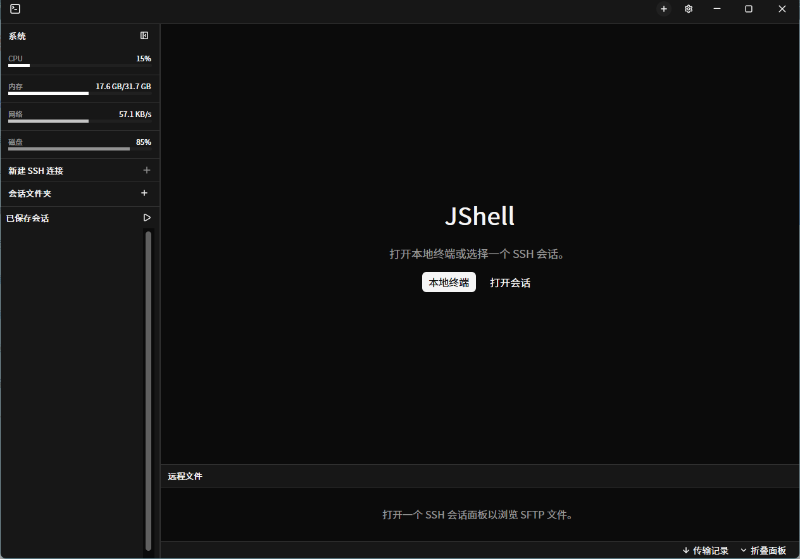

[中文](README.md) | [English](README.en.md)

# Ashell

Ashell 是一个用 Rust 与 GPUI 构建的桌面终端工作区。它把 SSH、SFTP、文件传输、会话组织和主机状态放进一套紧凑的 Windows 风格界面，适合在多个服务器之间持续切换和操作。



## 当前能力

### 会话与工作区

- 本地终端、SSH 和串口会话。
- 已保存 SSH 会话再次打开时会定位到已有连接，不创建重复窗口或重复连接。
- 会话文件夹支持新建、折叠、编辑、批量打开，并可将已保存会话复制或移动到文件夹。
- 一个工作区支持水平或垂直分屏，方便同时观察多个终端。
- 断开后的 SSH 会话可在终端中重新连接。

### SSH 与文件

- 支持密码、私钥文件和内联私钥认证。
- 内置 SFTP：远程目录列表、上传、下载、新建目录、删除和本地编辑后自动上传。
- 文件列表可显示以 `.` 开头的隐藏文件和目录，并清晰区分文件与文件夹。
- 传输任务、进度和状态集中显示在底部面板。

### 终端体验

- 可隐藏的命令输入栏：从标题栏打开，历史命令、搜索和补全在同一入口完成。
- SSH 历史命令可从服务器读取；选中历史或补全候选只会回填，按 `Enter` 后才执行。
- 历史补全作为内置插件提供，可在设置中独立启用或关闭。
- 终端默认使用系统等宽字体，并按实际字形宽度校准网格；UI 使用内置 Noto Sans CJK SC。

### 界面与主题

- 自定义 Windows 标题栏、会话标签、窗口控制和当前 SSH 标签状态。
- 左侧工作区包含 CPU、内存、Swap、网络和磁盘监测。
- 提供 Ashell Light、Ashell Dark 和 VS Code Dark 三套主题。
- SFTP 面板、侧边栏和窗口布局可按需要调整和保存。

## 开始使用

### 前置条件

- Rust stable toolchain（最低 Rust 1.85）
- Windows、macOS 或 Linux 桌面环境

字体文件已随程序提供，无需额外安装。

### 开发运行

```bash
cargo run
```

### 构建 Release

```bash
cargo build --release
```

Windows 可执行文件位于：

```text
target/release/ashell.exe
```

## 配置

默认配置文件：

```text
~/.config/ashell/sessions.json
```

Windows 上通常为：

```text
C:\Users\<用户名>\.config\ashell\sessions.json
```

配置中会保存已保存会话、会话文件夹、主题、字体、快捷键、窗口布局和 SFTP 显示选项。可在设置中的“配置文件”页面导出或导入本地配置。

## 验证

```bash
cargo fmt --check
cargo test --quiet
cargo check --all-targets
cargo build --release
```

## 致谢

本项目基于 [TomZz](https://github.com/TomZz) 创建的 [rust-kotlin/ashell](https://github.com/rust-kotlin/ashell) 演进而来。感谢原作者和所有上游贡献者提供的基础与持续投入。

## 许可证

本项目采用 [GPL-3.0-or-later](LICENSE) 许可证。
